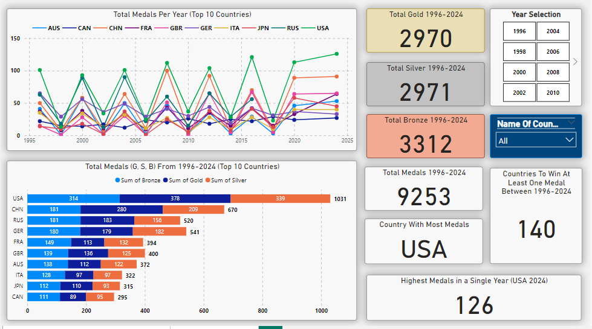
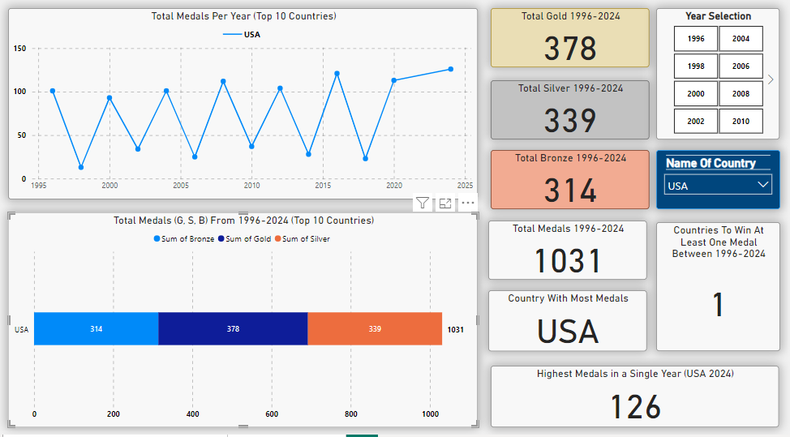
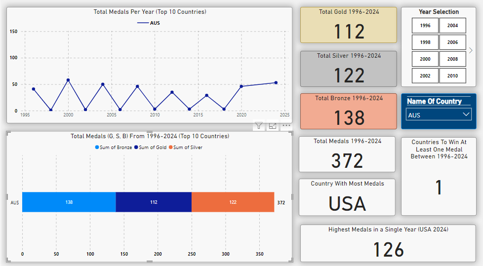
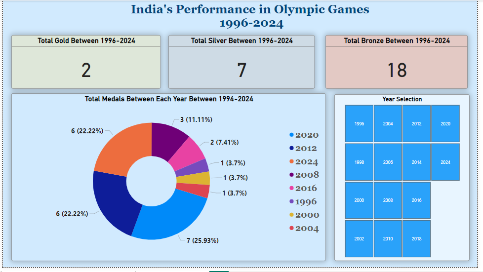
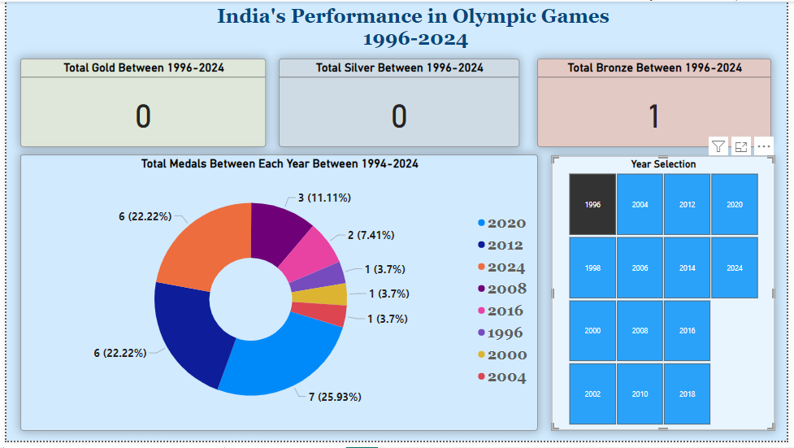

# Olympics-Data-Analysis
A brief Olympics data analysis from 1996 to 2024.

# Olympics Data Analysis

This project analyzes Olympic medal data from 1996 to 2024, focusing on overall performance and India's performance in particular. The analysis includes medal trends and country performance using Power BI visualizations.

## Project Overview
- Tools Used: Python for data preprocessing, Power BI for visualization.
- Datasets: Olympic medal counts per country from 1996 to 2024 (Gold, Silver, Bronze).
- Key Insights: Country-wise medal analysis, India’s Olympic performance, and forecasting for 2028.

## Files
- `Olympics.pbix`: Power BI dashboard file.
- `Olympic.ipynb`: jupyter for data preprocessing.
- `olympics.csv`: Dataset in CSV format.

## How to Use
1. Clone this repository.
2. Open the `Olympics.pbix` file in Power BI to explore the dashboard.
3. Run the `Olympic.ipynb` file to preprocess the data if needed.

## Visuals

